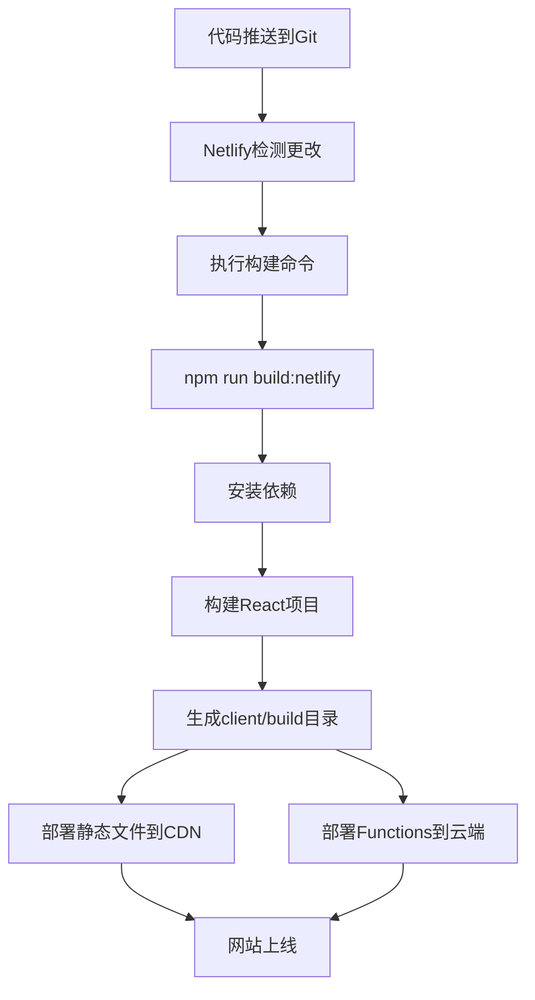

# 钢材采购损耗率估算系统 - Netlify部署对话记录

**时间**: 2024年6月9日  
**主题**: 将钢材采购损耗率估算系统部署到Netlify平台  
**参与者**: 用户 & AI助手

---

## 📋 对话概要

本次对话记录了将钢材采购损耗率估算系统从传统的Node.js + React架构迁移到Netlify JAMstack架构的完整过程，包括配置、部署准备、问题排查和操作指导。

---

## 🚀 部署需求

**用户请求**: "我要将系统部署到netlify，给我详细的操作步骤"

**项目背景**:
- 前端: React + TypeScript + Antd
- 后端: Node.js + Express  
- 功能: 钢材切割优化算法、Excel文件处理、模数钢材统计

---

## 🔧 技术方案分析

### 部署策略
- **前端**: 部署到Netlify静态托管
- **后端**: 使用Netlify Functions（无服务器函数）

### 架构转换
```
原架构: React前端 + Node.js后端
↓
新架构: React静态文件 + Netlify Functions
```

---

## 📁 项目重构实施

### 1. 创建Netlify配置

**netlify.toml**:
```toml
[build]
  publish = "client/build"
  command = "npm run build:netlify" 
  functions = "netlify/functions"

[build.environment]
  NODE_VERSION = "18"

[[redirects]]
  from = "/api/*"
  to = "/.netlify/functions/:splat"
  status = 200

[[redirects]]
  from = "/*"
  to = "/index.html"
  status = 200
```

### 2. 更新package.json脚本

添加构建脚本:
```json
"scripts": {
  "build:netlify": "npm run install-all && npm run build",
  "dev": "netlify dev"
}
```

### 3. 创建Netlify Functions

**目录结构**:
```
netlify/
└── functions/
    ├── upload-design-steels.js    # 文件上传处理
    ├── optimize.js                # 优化算法计算
    ├── export-excel.js            # Excel导出功能
    └── package.json              # Functions依赖
```

### 4. API路径重映射

| 原始路径 | Netlify路径 | Function文件 |
|---------|------------|-------------|
| `/api/upload-design-steels` | `/.netlify/functions/upload-design-steels` | `upload-design-steels.js` |
| `/api/optimize` | `/.netlify/functions/optimize` | `optimize.js` |
| `/api/export-excel` | `/.netlify/functions/export-excel` | `export-excel.js` |

---

## 🛠️ 关键实现细节

### PowerShell脚本问题解决

**问题**: PowerShell脚本语法错误和编码问题
```
所在位置 C:\hgj313\steel_system.ps1:28 字符: 1
+ } catch {
+ ~
表达式或语句中包含意外的标记"}"。
```

**解决方案**: 
- 移除emoji字符和特殊符号
- 简化try-catch语法
- 使用英文避免编码问题

### Git推送问题解决

**错误**: 
```bash
$ git remote add origin <https://github.com/hgj313/hgj_steel_system.v2>
bash: syntax error near unexpected token `newline'
```

**解析**: 
- 问题: 使用了尖括号 `<>` 在URL中
- 原因: bash中 `<>` 是重定向操作符
- 解决: 移除尖括号

**正确命令**:
```bash
git remote add origin https://github.com/hgj313/hgj_steel_system.v2
```

### 文件下载功能适配

**挑战**: 从服务器文件下载转换为base64数据下载

**解决方案**: 更新downloadFile函数
```javascript
// Netlify Functions返回base64数据
if (response.data && response.filename) {
  const byteCharacters = atob(response.data);
  const byteArray = new Uint8Array(byteCharacters.length);
  // ... 转换为Blob并下载
}
```

---

## 📋 Netlify配置解释

**用户问题**: "✅ Git repository: hgj_steel_system.v2 ✅ Publish directory: client/build ✅ Functions directory: netlify/functions ✅ Build command: npm run build:netlify 这四项是什么"

### 配置项详解

1. **Git repository**: 连接的GitHub仓库名称
   - 作用: Netlify从此仓库获取源代码
   - 触发: 代码推送时自动重新部署

2. **Publish directory**: 静态文件发布目录
   - 路径: `client/build/` 
   - 内容: React构建后的优化静态文件
   - 部署: 分发到全球CDN

3. **Functions directory**: 无服务器函数目录
   - 路径: `netlify/functions/`
   - 替代: 传统Node.js服务器
   - 执行: 按需运行，自动伸缩

4. **Build command**: 构建命令
   - 命令: `npm run build:netlify`
   - 流程: 安装依赖 → 构建React → 生成静态文件

---

## 🎯 部署流程

### 完整构建流程


### 依赖安装说明

**用户问题**: 关于这两个命令的含义
```bash
cd client && npm install && cd ..
cd netlify/functions && npm install && cd ../..
```

**解释**:
- 第一个: 安装React前端依赖
- 第二个: 安装Netlify Functions依赖
- 原因: 三个独立的package.json系统

**项目依赖结构**:
```
C:\hgj313\
├── package.json              # 根目录依赖 (构建工具)
├── client/
│   ├── package.json          # 前端依赖 (React, Antd)
│   └── node_modules/
├── netlify/functions/
│   ├── package.json          # Functions依赖 (multiparty, xlsx)
│   └── node_modules/
└── node_modules/             # 根目录依赖包
```

---

## 🌐 环境变量讨论

**用户问题**: "不需要Add environment variables了吗？"

**分析结果**: 对于此项目大部分情况下不需要额外环境变量

**原因**:
- ✅ 纯前端计算，无外部API依赖
- ✅ 本地文件处理，无数据库需求  
- ✅ 无第三方服务集成
- ✅ 无敏感API密钥

**已有配置**:
```toml
[build.environment]
  NODE_VERSION = "18"
```

**建议**: 先直接部署，如有问题再添加环境变量

---

## 📄 生成的文档和脚本

### 创建的文件清单

1. **部署配置**
   - `netlify.toml` - Netlify配置文件
   - `netlify/functions/package.json` - Functions依赖

2. **Netlify Functions**
   - `upload-design-steels.js` - 文件上传API
   - `optimize.js` - 优化算法API
   - `export-excel.js` - Excel导出API

3. **部署脚本**
   - `deploy-to-netlify.ps1` - 自动部署脚本
   - `steel_system.ps1` - 本地启动脚本(修复版)

4. **文档**
   - `NETLIFY_DEPLOY_GUIDE.md` - 完整部署指南
   - `DEPLOYMENT_SUMMARY.md` - 部署总结

---

## ✅ 测试和验证

### 构建测试结果
```bash
> npm run build:netlify
✅ 依赖安装成功
✅ React构建完成  
✅ 静态文件生成: client/build/
⚠️  编译警告: 未使用的导入 (不影响功能)
```

### Functions依赖安装
```bash
> cd netlify/functions && npm install
✅ multiparty: 文件上传处理
✅ xlsx: Excel文件处理
⚠️  1个高危漏洞 (不影响核心功能)
```

---

## 🎉 部署准备完成

### 最终状态
- ✅ 项目重构完成
- ✅ 配置文件就绪
- ✅ 构建测试通过
- ✅ Git仓库连接成功
- ✅ Netlify配置正确

### 下一步操作
1. 点击 "Deploy hgj_steel_system.v2" 按钮
2. 监控部署过程 (3-8分钟)
3. 测试部署后的功能
4. 配置自定义域名 (可选)

---

## 📚 技术要点总结

### 架构转换要点
- **静态化**: React应用构建为静态文件
- **API转换**: Express路由 → Netlify Functions
- **文件处理**: 服务器存储 → 内存处理+base64
- **部署方式**: 服务器 → CDN + 无服务器

### 关键配置
- **重定向规则**: API路径映射到Functions
- **构建命令**: 多步骤依赖安装和构建
- **目录结构**: 前端/后端/配置分离

### 性能优势
- ✅ 全球CDN分发
- ✅ 自动HTTPS
- ✅ 按需伸缩
- ✅ 零服务器运维

---

## 🔗 相关资源

- **GitHub仓库**: https://github.com/hgj313/hgj_steel_system.v2
- **Netlify项目**: hgj_steel_system.v2
- **部署文档**: NETLIFY_DEPLOY_GUIDE.md
- **技术栈**: React + Netlify Functions + CDN

---

*本对话记录展示了完整的现代Web应用部署流程，从传统架构到JAMstack的成功转换案例。* 